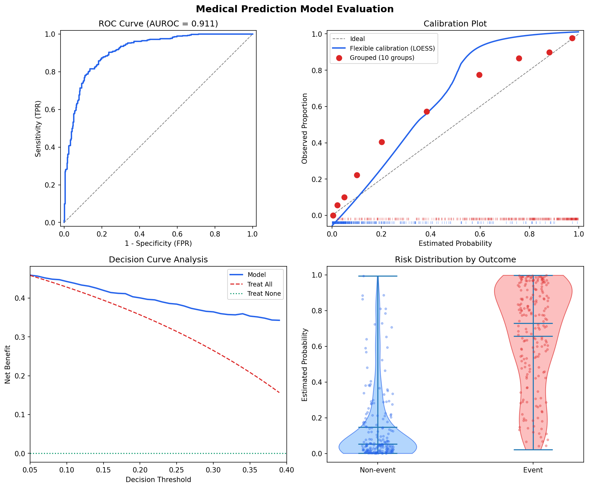
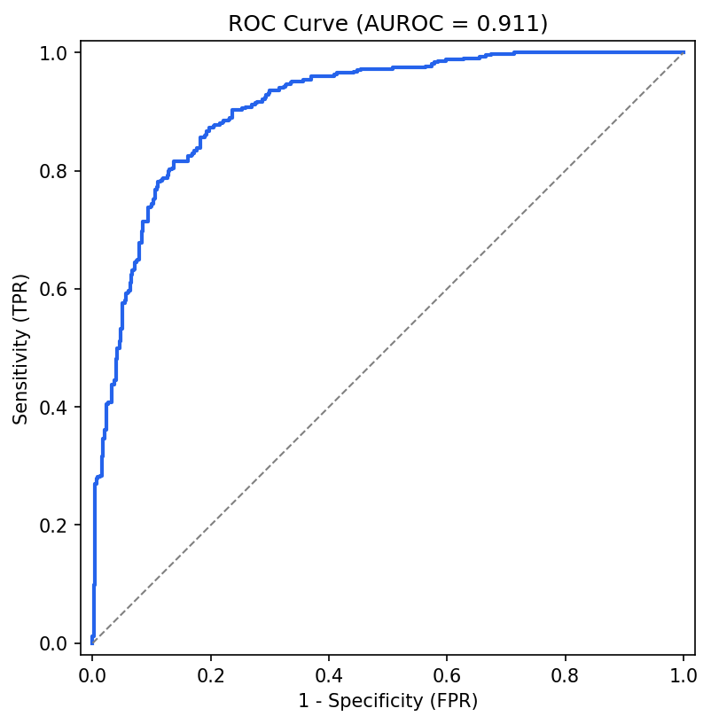
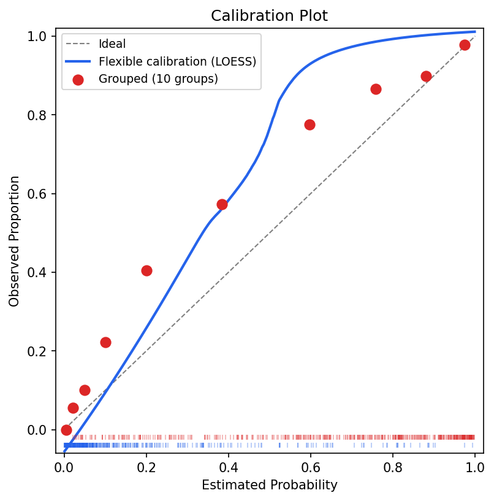
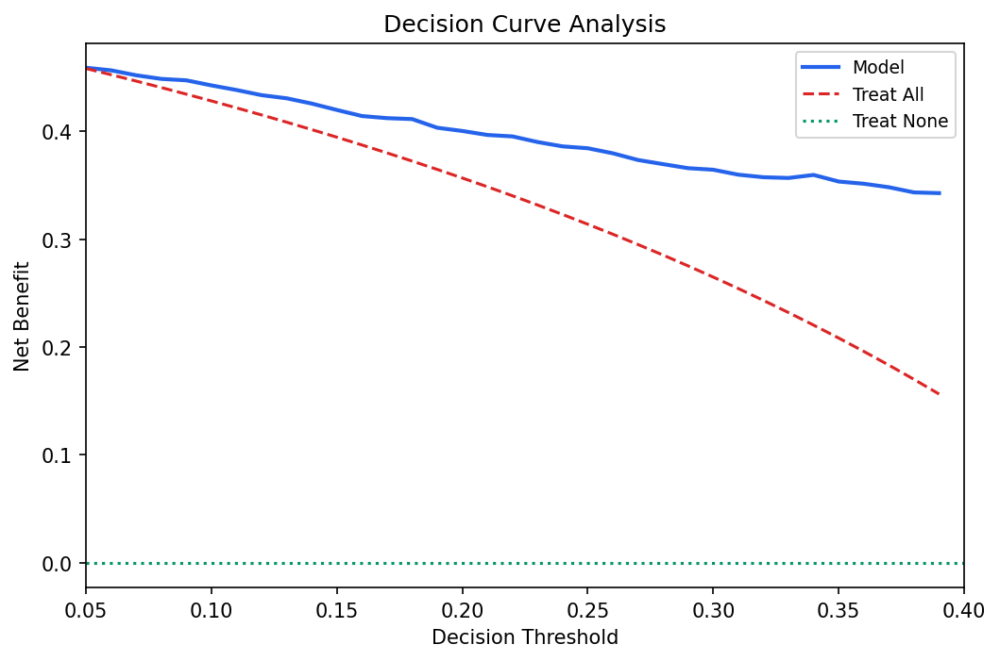
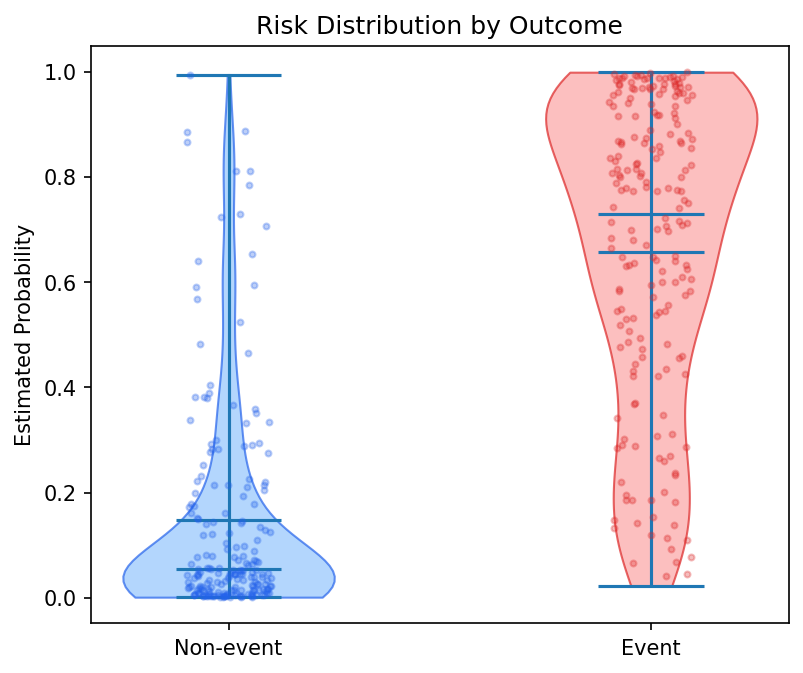
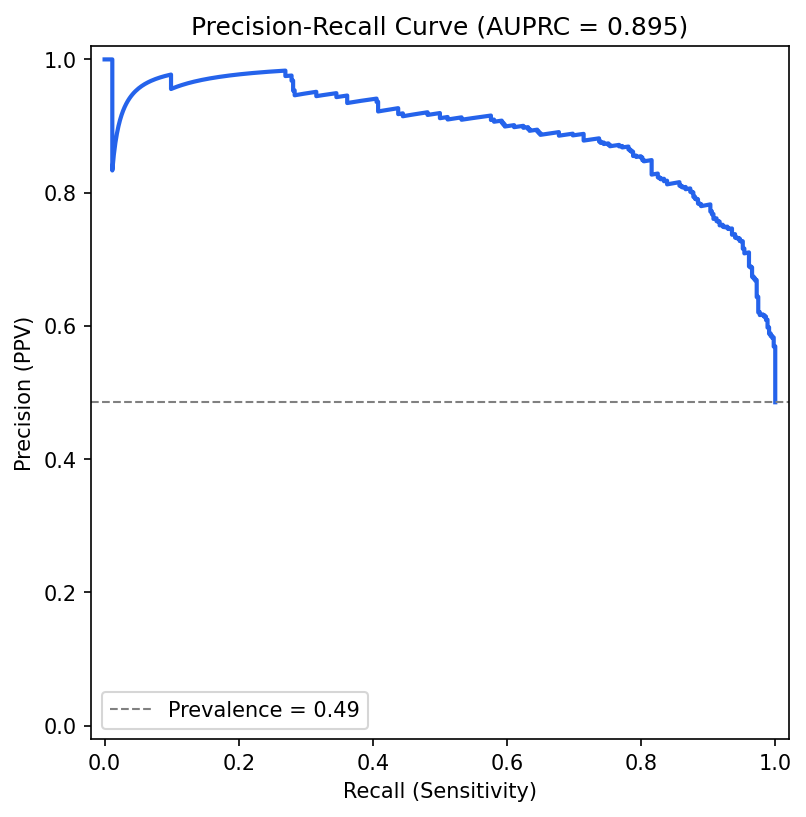
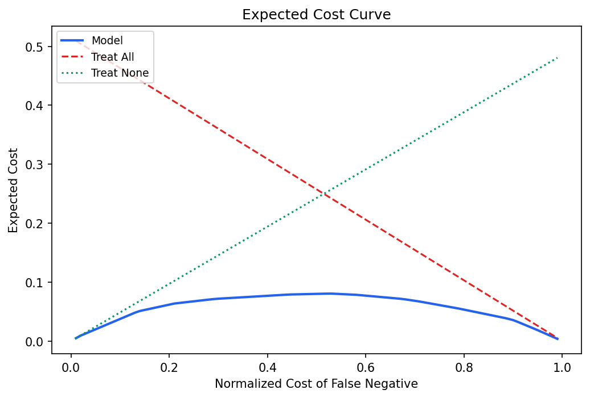
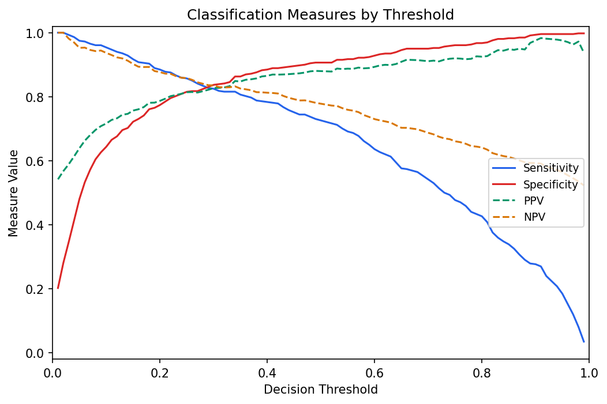
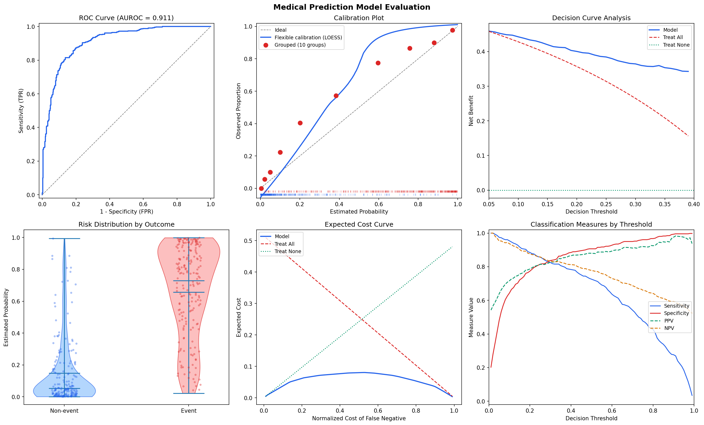

# ADNEX Walkthrough

This walkthrough shows the intended `medpred-eval` workflow on the ADNEX
example data. The model predicts malignancy risk for women with an ovarian
tumour, and the clinical decision threshold used here is `0.10`.

The package is intentionally opinionated: start with the core report and the
core plots, then use the full metric inventory only when you need a detailed
audit or compatibility with older analysis code.

## Setup

```bash
uv sync --dev
```

```python
from pathlib import Path

import pandas as pd
import medpred

data = Path("examples/data/adnex_case_study.txt")
df = pd.read_csv(data, sep=r"\s+")

y_true = df["Outcome1"].to_numpy(dtype=int)
y_prob = df["pmalwo"].to_numpy(dtype=float)
```

The example has 894 patients and an observed malignancy prevalence of about
49%.

## Core Evaluation

```python
report = medpred.evaluate(y_true, y_prob, threshold=0.10)
print(report.to_frame().round(3))
```

Example output:

| Domain | Measure | Value | Guidance |
| --- | --- | ---: | --- |
| discrimination | auroc | 0.911 | recommended |
| calibration | oe_ratio | 1.228 | supporting |
| calibration | calibration_intercept | 0.753 | supporting |
| calibration | calibration_slope | 0.934 | supporting |
| overall | brier_score | 0.133 | supporting |
| clinical_utility | net_benefit | 0.443 | recommended |
| clinical_utility | standardized_net_benefit | 0.912 | recommended |
| classification_descriptive | sensitivity | 0.954 | descriptive |
| classification_descriptive | specificity | 0.643 | descriptive |
| classification_descriptive | ppv | 0.716 | descriptive |
| classification_descriptive | npv | 0.937 | descriptive |

The threshold `0.10` means that a false negative is treated as about nine
times more costly than a false positive. That threshold should come from the
clinical decision, not from optimizing a statistical score.

## Core Plot Panel

```python
report.plot(
    threshold_range=(0.05, 0.40),
    save_path="docs/assets/adnex_core_panel.png",
)
```



The four panels match the recommended routine validation view:

- ROC curve with AUROC for discrimination.
- Calibration plot to show whether predicted probabilities match observed risk.
- Decision curve to compare the model with treating all or treating none.
- Risk distribution by outcome to show how model probabilities behave.

## Individual Plot Functions

The core panel is enough for most reports. Individual plots are useful when
writing a manuscript, debugging model behaviour, or composing custom figures.

### ROC Curve

```python
from medpred.visualization import plot_roc_curve

plot_roc_curve(y_true, y_prob, auroc=report.core["discrimination"]["auroc"])
```



AUROC measures ranking: whether events tend to receive higher probabilities
than non-events. It is useful, but it cannot establish clinical usefulness by
itself.

### Calibration Plot

```python
from medpred.visualization import plot_calibration

plot_calibration(y_true, y_prob)
```



The calibration plot is the main calibration diagnostic. Summary measures such
as O:E ratio, calibration intercept, and calibration slope are helpful, but
they cannot show the shape or direction of miscalibration as well as the plot.

### Decision Curve

```python
from medpred.visualization import plot_decision_curve

plot_decision_curve(y_true, y_prob, threshold_range=(0.05, 0.40))
```



Decision curve analysis shows net benefit across clinically plausible decision
thresholds. The key question is whether the model is better than both default
strategies: treat all and treat none.

### Risk Distribution

```python
from medpred.visualization import plot_risk_distribution

plot_risk_distribution(y_true, y_prob)
```



Risk distributions make the model's behaviour tangible: they show whether
predicted probabilities separate outcome groups and whether many patients sit
near the decision threshold.

### Precision-Recall Curve

```python
from medpred.visualization import plot_pr_curve

full = medpred.evaluate_all(y_true, y_prob, threshold=0.10)
plot_pr_curve(y_true, y_prob, auprc=full["discrimination"]["auprc"])
```



The PR curve is available, but AUPRC is not a preferred primary metric for this
medical-decision workflow. It ignores true negatives and mixes statistical and
decision-analytical concerns without using decision-theoretic costs.

### Expected Cost Curve

```python
from medpred.visualization import plot_expected_cost_curve

plot_expected_cost_curve(y_true, y_prob)
```



Expected cost evaluates decisions under explicit false-negative and
false-positive cost assumptions. It is useful as a decision-analytic companion
to net benefit.

### Classification Measures By Threshold

```python
from medpred.visualization import plot_classification_at_thresholds

plot_classification_at_thresholds(y_true, y_prob)
```



Sensitivity, specificity, PPV, and NPV are descriptive when reported as pairs.
They should not replace clinical utility analysis.

### Full Panel

```python
from medpred.visualization import plot_full_evaluation

plot_full_evaluation(
    y_true,
    y_prob,
    auroc=full["discrimination"]["auroc"],
    auprc=full["discrimination"]["auprc"],
    threshold_range=(0.05, 0.40),
)
```



Use the full panel for exploration. For a concise report, prefer the core panel.

## Recalibration

```python
recalibrated = medpred.logistic_recalibration(y_true, y_prob)
recalibrated_report = medpred.evaluate(y_true, recalibrated, threshold=0.10)
print(recalibrated_report.to_frame().round(3))
```

Logistic recalibration is rank preserving, so AUROC should remain unchanged.
Calibration and strictly proper scores may improve. In this example:

- AUROC stays around `0.911`.
- O:E ratio improves from `1.228` to about `1.000`.
- Calibration intercept improves from `0.753` to about `0.001`.
- Calibration slope improves from `0.934` to about `1.000`.
- Brier score improves from `0.133` to about `0.118`.

## Bootstrap Intervals

```python
report_ci = medpred.evaluate(
    y_true,
    y_prob,
    threshold=0.10,
    n_bootstrap=1000,
    random_state=42,
)

print(report_ci.to_frame().round(3))
```

Bootstrap intervals are useful for statistical performance measures. Be careful
with intervals for clinical utility measures: the paper notes that uncertainty
quantification for decision analysis remains debated.

## Full Metric Inventory

```python
full = medpred.evaluate_all(y_true, y_prob, threshold=0.10)

full["discrimination"]
full["calibration"]
full["overall"]
full["classification"]
full["clinical_utility"]
```

Use `evaluate_all` when you need every implemented metric. Use
`medpred.evaluate` for the default report.

## Function Reference

### Top-Level API

| Function | Purpose |
| --- | --- |
| `medpred.evaluate` | Core report for binary medical prediction validation. |
| `medpred.evaluate_all` | Full metric inventory across all implemented domains. |
| `medpred.plot_report` | Plot the core 2x2 report from an `EvaluationReport`. |
| `medpred.logistic_recalibration` | Rank-preserving logistic recalibration of predicted probabilities. |

### `EvaluationReport`

| Member | Purpose |
| --- | --- |
| `report.core` | Nested dictionary of the core report. |
| `report.meta` | Sample size, event counts, prevalence, threshold, cost ratio. |
| `report.extended` | Optional full inventory when `include_extended=True`. |
| `report.ci` | Optional bootstrap intervals when `n_bootstrap` is set. |
| `report.to_dict()` | JSON-like payload without hidden plotting arrays. |
| `report.to_frame()` | Tidy dataframe with guidance columns. |
| `report.plot()` | Save or display the core plot panel. |

### Compatibility API

These wrappers exist for older code:

| Function | Replacement |
| --- | --- |
| `medpred.evaluate.evaluate_model` | Use `medpred.evaluate_all`. |
| `medpred.evaluate.evaluate_with_ci` | Use `medpred.evaluate(..., n_bootstrap=...)`. |
| `medpred.evaluate.results_to_dataframe` | Use `report.to_frame()`. |

### Metric Modules

| Function | Purpose |
| --- | --- |
| `discrimination_metrics` | AUROC, AUPRC, pAUROC. |
| `roc_curve_data` | FPR, TPR, thresholds for ROC plotting. |
| `pr_curve_data` | Precision, recall, thresholds for PR plotting. |
| `calibration_metrics` | O:E ratio, intercept, slope, ECI, ICI, ECE. |
| `calibration_curve_data` | Grouped and smoothed calibration curve data. |
| `logistic_recalibration` | Fit recalibration on `logit(y_prob)`. |
| `overall_metrics` | Loglikelihood, logloss, Brier, scaled Brier, R-squared variants, discrimination slope, MAPE. |
| `classification_metrics` | Threshold confusion matrix and classification measures. |
| `clinical_utility_metrics` | Net benefit, standardized net benefit, expected cost. |
| `net_benefit_curve` | Net benefit curve data across thresholds. |
| `expected_cost_curve` | Expected cost curve data across cost ratios. |

### Plotting

| Function | Purpose |
| --- | --- |
| `plot_core_evaluation` | Recommended 2x2 panel. |
| `plot_full_evaluation` | Exploratory 2x3 panel. |
| `plot_roc_curve` | ROC curve. |
| `plot_pr_curve` | Precision-recall curve. |
| `plot_calibration` | Calibration diagram with grouped and smoothed estimates. |
| `plot_risk_distribution` | Predicted-risk distributions by outcome. |
| `plot_decision_curve` | Net benefit decision curve. |
| `plot_expected_cost_curve` | Expected cost curve. |
| `plot_classification_at_thresholds` | Sensitivity, specificity, PPV, and NPV across thresholds. |

### Utilities

| Function | Purpose |
| --- | --- |
| `load_binary_table` | Load outcome and probability columns from a user table. |
| `bootstrap_ci` | Percentile bootstrap intervals for metric functions. |

Private helpers with leading underscores are implementation details.

## Important Points From The Paper

- Report a core set: AUROC, calibration plot, clinical utility such as net
  benefit with decision curve analysis, and risk distributions by outcome.
- A decision threshold should be clinically justified. Do not choose it by
  maximizing Youden index or another statistical threshold score.
- Statistical performance and clinical utility are different questions.
  Discrimination and calibration do not prove that using a model improves
  decisions.
- Properness matters. A proper measure cannot be beaten in expectation by an
  incorrect model; improper measures can reward the wrong model.
- F1 is especially problematic here because it is improper and lacks clear
  statistical or decision-analytical focus.
- AUPRC and pAUROC are available but inadvisable as primary measures in this
  framework because they blur statistical and decision-analytical evaluation.
- Accuracy, balanced accuracy, Youden index, diagnostic odds ratio, kappa, F1,
  and MCC are not primary clinical-validation evidence at clinically relevant
  thresholds.
- Sensitivity/specificity and PPV/NPV can be useful descriptively, but report
  them as pairs and interpret them at a clinically meaningful threshold.
- Class imbalance is not the same as misclassification cost. Costs come from
  the clinical decision and intervention context.
- For external validation, calibration is central. The calibration plot is
  usually more informative than a single calibration summary.
